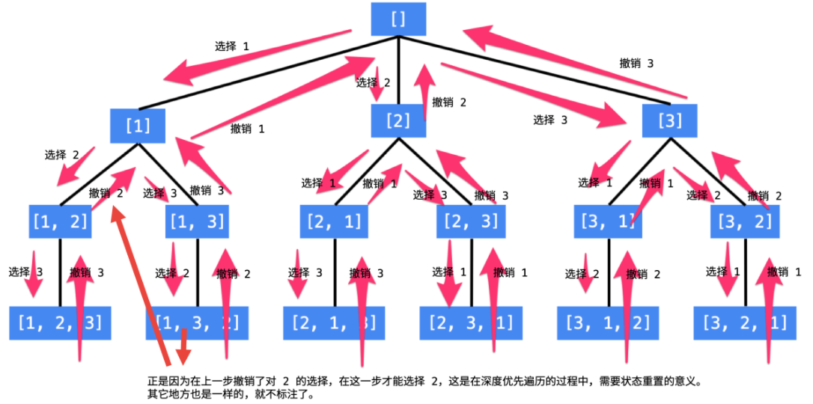
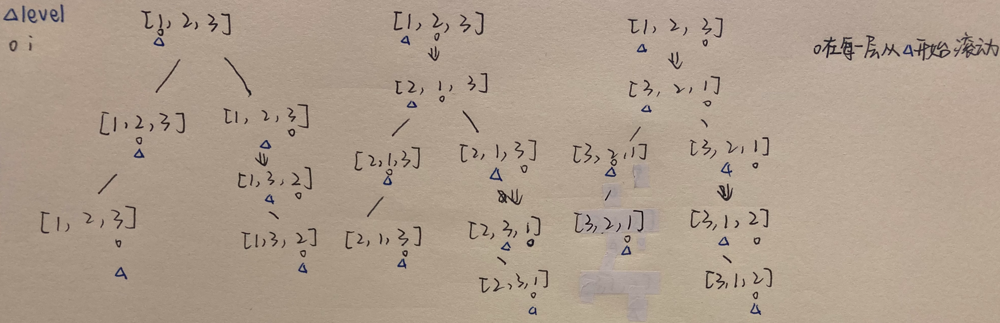
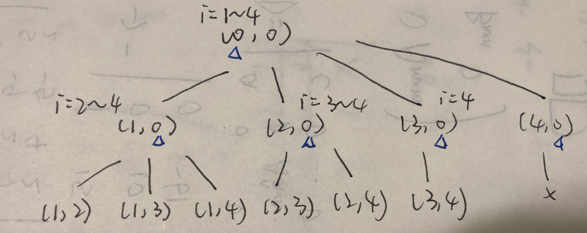

# 搜索

## 深度优先搜索

- 借助栈/递归实现
- 记忆化：对已经搜索过的节点进行标记，防止遍历时重复搜索某个节点

### 最大岛屿面积

- 辅助函数dfs：判断边界条件后再进行递归
- 用两个数组控制四个方向的遍历
- 另外一种变形：求岛屿数量，即看主函数中调用了多少次dfs

```C++
    vector<int> x{-1,1,0,0};
    vector<int> y{0,0,-1,1};
    
    void dfs(vector<vector<int>>& grid, int i, int j, int h, int w, int& area) {
        grid[i][j] = 0;
        area++;
        for (int k = 0; k < 4; k++) {
            int new_i = i + x[k];
            int new_j = j + y[k];
            // 边界条件1：不能数组越界
            if (new_i >= 0 && new_i < h && new_j >= 0 && new_j < w) {
                // 边界条件2：是个岛屿
                if (grid[new_i][new_j] == 1) {
                    dfs(grid, new_i, new_j, h, w, area);
                }
            }
        }
    }
    
    int maxAreaOfIsland(vector<vector<int>>& grid) {
        int w = grid[0].size();
        int h = grid.size();
        int area = 0;
        int maxArea = 0;
        for (int i = 0; i < h; i++)
            for (int j = 0; j < w; j++) {
                if (grid[i][j] == 1) {
                    dfs(grid, i, j, h, w, area);
                    if (area > maxArea)
                        maxArea = area;
                    area = 0;
                }
            }
        return maxArea;
    }
```

### 朋友圈

- 这一题的图和岛屿表示的含义不太一样，不能混淆
- 这里的输入是邻接矩阵
- `visited`数组可以记录每个节点的状态

```c++
    void dfs(vector<vector<int>>& isConnected, int i, vector<bool>& visited) {
        visited[i] = true;
        for (int j = 0; j < isConnected[0].size(); j++) {
            if (j == i)
                continue;
            if (isConnected[i][j] == 1 && visited[j] == false)
                dfs(isConnected, j, visited);
        }
    }
    
    int findCircleNum(vector<vector<int>>& isConnected) {
        int count = 0;
        vector<bool> visited;
        for (int i = 0; i < isConnected.size(); i++) {
            visited.push_back(false);
        }
        for (int i = 0; i < isConnected.size(); i++) {
            if (visited[i] == false) {
                count++;
                dfs(isConnected, i, visited);
            }
        }
        return count;
    }
```

### 太平洋大西洋水流

- 问题转换：水从高处往低处流，看能不能到达边界要对每个点深搜，太麻烦了，所以可以尝试转换成别的（对偶？）形式，即水从四条边界开始，从低往高处流，记录水可以流到的点，最后取个并集就是答案了

```c++
    vector<int> x{-1,1,0,0};
    vector<int> y{0,0,-1,1};

    void dfs(vector<vector<int>>& heights, int i, int j, vector<vector<bool>>& reach) {
        reach[i][j] = true;
        for (int k = 0; k < 4; k++) {
            int new_i = i + x[k];
            int new_j = j + y[k];
            if (new_i >= 0 && new_i < heights.size() && new_j >= 0 && new_j < heights[0].size()) {
                if (!reach[new_i][new_j] && heights[new_i][new_j] >= heights[i][j]) {
                    dfs(heights, new_i, new_j, reach);
                }
            }
        }
    }

    vector<vector<int>> pacificAtlantic(vector<vector<int>>& heights) {
        int m = heights.size();
        int n = heights[0].size();
        vector<vector<bool>> reach_p(m, vector<bool>(n,false));
        vector<vector<bool>> reach_a(m, vector<bool>(n,false));
        vector<vector<int>> ans;
        for (int i = 0; i < n; i++) {
            if (!reach_a[0][i])
                dfs(heights, 0, i, reach_a);
            if (!reach_p[m-1][i])
                dfs(heights, m-1, i, reach_p);
        }
        for (int j = 0; j < m; j++) {
            if (!reach_a[j][0])
                dfs(heights, j, 0, reach_a);
            if (!reach_p[j][n-1])
                dfs(heights, j, n-1, reach_p);
        }
        for (int i = 0; i < m; i++) {
            for (int j = 0; j < n; j++) {
                if (reach_a[i][j] && reach_p[i][j])
                    ans.push_back(vector<int>{i,j});
            }
        }
        return ans;
    }
```

## 回溯

- 用于需要记录节点状态的dfs：修改当前节点状态 - 递归子节点 - **回改当前节点**
- 排列、组合、选择类问题

### 全排列

- 回溯思路1：回溯是否可以把当前数字加入结果中
  - 状态变量：递归到第几层depth，已经选了哪些数path，布尔型数组visited
  - 输出顺序：[1,2,3], [1,3,2], [2,1,3], [2,3,1], [3,1,2], [3,2,1]



- 回溯思路2：回溯交换的位置
  - 输出顺序：[1,2,3], [1,3,2], [2,1,3], [2,3,1], [3,2,1], [3,1,2]



```c++
    void backtracking(vector<int>& nums, int level, vector<vector<int>>& ans) {
        if (level == nums.size() - 1) {
            ans.push_back(nums);
            return;
        }
        for (int i = level; i < nums.size(); i++) {
            swap(nums[i], nums[level]);
            backtracking(nums, level+1, ans);
            swap(nums[i], nums[level]);
        }
    }

    vector<vector<int>> permute(vector<int>& nums) {
        vector<vector<int>> ans;
        backtracking(nums, 0, ans);
        return ans;
    }
```

时间复杂度：$O(n*n!)$

### 数字组合

和排序问题不同的是，在组合问题中元素的顺序不考虑，只需要从当前位置向后寻找。排序问题每次都需要从头寻找，需要用visited数组记录访问过的元素。这里对应的处理是在递归调用回溯函数时，可选位置从`i+1`开始，而不是`pos+1`，后者对应从头寻找。

此外，这道题目中是给数组一个一个元素赋值，所以赋值元素的下标是回溯的层数。



```c++
    void backtracking(vector<vector<int>>& ans, vector<int>& output, int level, int pos, int n, int k) {
        if (level == k) {
            ans.push_back(output);
            return;
        }
        for (int i = pos; i <= n; i++) {
            output[level++] = i;
            backtracking(ans, output, level, i+1, n, k);
            level--;
        }
    }

    vector<vector<int>> combine(int n, int k) {
        vector<vector<int>> ans;
        vector<int> output(k,0);
        int level = 0;
        backtracking(ans, output, level, 1, n, k);
        return ans;
    }
```

### 单词搜索

- 和深搜很像，只是加多了一步重置visited数组状态

```c++
    vector<int> x{-1,1,0,0};
    vector<int> y{0,0,-1,1};

    void backtracking(int i, int j, vector<vector<char>>& board, string& word, bool& find, vector<vector<bool>>& visited, int pos) {
        if (pos == word.size() - 1) {
            find = true;
            return;
        }
        if (board[i][j] != word[pos])
            return;
        for (int k = 0; k < 4; k++) {
            int new_i = i + x[k];
            int new_j = j + y[k];
            if (new_i >= 0 && new_i < board.size() && new_j >= 0 && new_j < board[0].size() && !visited[new_i][new_j] && board[new_i][new_j] == word[pos+1]) {
                visited[i][j] = true;
                backtracking(new_i, new_j, board, word, find, visited, pos+1);
                visited[i][j] = false;
            }
        }
    }

    bool exist(vector<vector<char>>& board, string word) {
        int m = board.size();
        int n = board[0].size();
        bool find = false;
        vector<vector<bool>> visited(m, vector<bool>(n,false));
        for (int i = 0; i < m; i++) {
            for (int j = 0; j < n; j++) {
                if (!visited[i][j] && word.size() != 1)
                    backtracking(i, j, board, word, find, visited, 0);
                else if (word.size() == 1) {
                    if (board[i][j] == word[0])
                        find = true;
                }
            }
        }
        return find;
    }
```

### N皇后

- 难点在于左对角线和右对角线怎么表示：同一左对角线上的点横坐标和纵坐标的差相同（左上到右下），同一右对角线上的点横坐标和纵坐标的和相同（左下到右上）

```C++
    void backtracking(vector<vector<string>>& ans, vector<string>& board, vector<bool>& column, vector<bool>& ldiag, vector<bool>& rdiag, int row, int n) {
        if (row == n) {
            ans.push_back(board);
            return;
        }
        for (int pos = 0; pos < n; pos++) {
            if (column[pos] || ldiag[n-1-(row-pos)] || rdiag[row+pos])
                continue;
            else {
                column[pos] = true;
                ldiag[n-1-(row-pos)] = true;
                rdiag[row+pos] = true;
                board[row][pos] = 'Q';
                backtracking(ans, board, column, ldiag, rdiag, row+1, n);
                column[pos] = false;
                ldiag[n-1-(row-pos)] = false;
                rdiag[row+pos] = false;
                board[row][pos] = '.';
            }
        }
    }

    vector<vector<string>> solveNQueens(int n) {
        vector<vector<string>> ans;
        vector<string> board(n, string(n, '.'));
        vector<bool> column(n, false), ldiag(2*n-1, false), rdiag(2*n-1, false);
        backtracking(ans, board, column, ldiag, rdiag, 0, n);
        return ans;
    }
```

时间复杂度：$O(n!)$

## 广度优先搜索

