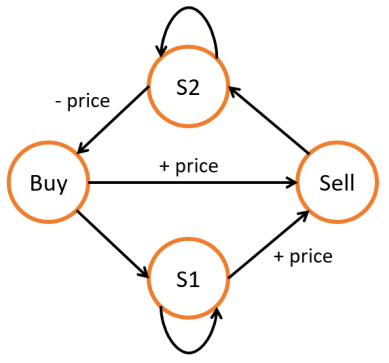

# 动态规划

- 动态规划与搜索的区别：动态规划会保存子问题的解，避免重复计算
- 空间压缩

## 一维动态规划

### 爬楼梯

- 空间压缩：只用两个变量来存储`dp[i-1]`和`dp[i-2]`

```c++
    int climbStairs(int n) {
        if (n <= 2)
            return n;
        int pre2 = 1, pre1 = 2, cur;
        for (int i = 2; i < n; i++) {
            cur = pre2 + pre1;
            pre2 = pre1;
            pre1 = cur;
        }
        return cur;
    }
```

### 打家劫舍

- `dp[i]`表示抢劫到第i个房子时，可以抢劫的最大数量

- 状态转移方程：考虑两种情况，要抢劫第i个房子和不抢劫第i个房子，前者`dp[i]=dp[i-2]+nums[i-1]`，i-2是因为如果要抢第i个房子，就不能抢第i-1个；后者`dp[i]=dp[i-1]`

```C++
    int rob(vector<int>& nums) {
        int n = nums.size();
        vector<int> dp(n+1, 0);
        dp[1] = nums[0];
        for (int i = 2; i <= n; i++) {
            dp[i] = max(dp[i-1], dp[i-2]+nums[i-1]);
        }
        return dp[n];
    }
```

### 等差数列

- 为什么最后要把dp数组的值加起来作为结果：因为`dp[i]`表示的只是以`nums[i]`结尾的等差数列个数，而等差子数组可以在任意一个位置终止，所以要加起来

```C++
    int numberOfArithmeticSlices(vector<int>& nums) {
        int n = nums.size();
        if (n < 3)
            return 0;
        vector<int> dp(n, 0);
        for (int i = 2; i < n; i++) {
            if (nums[i] - nums[i-1] == nums[i-1] - nums[i-2]) {
                dp[i] = dp[i-1] + 1;
            }
        }
        return accumulate(dp.begin(), dp.end(), 0);
    }
```

## 二维动态规划

### 最小路径和

- 两个方向的搜索
- `dp[i][j]`表示从左上角到`(i,j)`位置的最优路径的数字和

```c++
int minPathSum(vector<vector<int>>& grid) {
        int m = grid.size();
        int n = grid[0].size();
        vector<vector<int>> dp(m, vector<int>(n,0));
        dp[0][0] = grid[0][0];
        for (int i = 1; i < m; i++) {
            dp[i][0] = grid[i][0] + dp[i-1][0];
        }
        for (int j = 1; j < n; j++) {
            dp[0][j] = grid[0][j] + dp[0][j-1];
        }
        for (int i = 1; i < m; i++) {
            for (int j = 1; j < n; j++) {
                dp[i][j] = min(dp[i-1][j], dp[i][j-1]) + grid[i][j];
            }
        }
        return dp[m-1][n-1];
    }
```

- 空间压缩（待补充）

### 01矩阵

- 难点在于如何完成四个方向的搜索：两次dp

```C++
    vector<vector<int>> updateMatrix(vector<vector<int>>& mat) {
        int m = mat.size();
        int n = mat[0].size();
        vector<vector<int>> dp(m,vector<int>(n,INT_MAX - 1));
        // 向右和向下
        for (int i = 0; i < m; i++) {
            for (int j = 0; j < n; j++) {
                if (!mat[i][j]) {
                    dp[i][j] = 0;
                }
                else {
                    if (j > 0) {
                        dp[i][j] = min(dp[i][j], dp[i][j-1]+1);
                    }
                    if (i > 0) {
                        dp[i][j] = min(dp[i][j], dp[i-1][j]+1);
                    }
                }
            }
        }
        // 向左和向上
        for (int i = m - 1; i >= 0; i--) {
            for (int j = n - 1; j >= 0; j--) {
                if (mat[i][j]) {
                    if (j < n - 1) {
                        dp[i][j] = min(dp[i][j], dp[i][j+1]+1);
                    }
                    if (i < m - 1) {
                        dp[i][j] = min(dp[i][j], dp[i+1][j]+1);
                    }
                }
            }
        }
        return dp;
    }
```

### 最大正方形

- `dp[i][j] `表示满足题目条件的、以 `(i, j)` 为右下角的正方形或者长方形的属性
- 当我们判断以某个点为正方形右下角时最大的正方形时，那它的上方，左方和左上方三个点也一定是某个正方形的右下角，否则该点为右下角的正方形最大就是它自己了
- 如果dp数组的行和列比matrix多1可以简化一些代码(leetcode101的做法)，但不加一也是可以的

```c++
    int maximalSquare(vector<vector<char>>& matrix) {
        int m = matrix.size(), n = matrix[0].size(), max_side = 0;
        vector<vector<int>> dp(m, vector<int>(n,0));
        bool allzero = true;
        for (int i = 0; i < m; i++) {
            for (int j = 0; j < n; j++) {
                if (matrix[i][j] == '1') {
                    dp[i][j] = 1;
                    allzero = false;
                }
            }
        }
        max_side = allzero ? 0 : 1;
        for (int i = 1; i < m; i++) {
            for (int j = 1; j < n; j++) {
                if (matrix[i][j] == '1' && matrix[i-1][j-1] == '1' && matrix[i-1][j] == '1' && matrix[i][j-1] == '1') {
                    dp[i][j] = min(dp[i-1][j-1], min(dp[i-1][j], dp[i][j-1])) + 1;
                }
                max_side = max(max_side, dp[i][j]);
            }
        }
        return max_side * max_side;
    }
```

## 分割问题

### 完美平方数

- 状态转移方程依赖于满足分割条件的位置
- `dp[i]`表示数字$i$最少可以由几个完全平方数相加构成，位置$i$只依赖$i-k^2$的位置，如$i-1，i-4，i-9...$

```C++
    int numSquares(int n) {
        vector<int> dp(n+1, INT_MAX);
        dp[0] = 0;
        for (int i = 1; i <= n; i++) {
            for (int j = 1; j*j <= i; j++) {
                dp[i] = min(dp[i], dp[i-j*j]+1);
            }
        }
        return dp[n];
    }
```

### 单词拆分

- 思路类似上题
- 注意点：对于位置0，要初始化值为真

```c++
    bool wordBreak(string s, vector<string>& wordDict) {
        int n = s.size();
        vector<bool> dp(n + 1, false);
        dp[0] = true;
        for (int i = 1; i <= n; i++) {
            for (string word : wordDict) {
                int len = word.size();
                if (i >= len && s.substr(i - len, len) == word) {
                    dp[i] = dp[i] || dp[i - len];
                }
            }
        }
        return dp[n];
    }
```

## 子序列问题

### 最长递增子序列：一维dp

- `dp[i]`表示以 i 结尾的、最长子序列长度
- 为什么要两次循环：要找位置i前面的位置j，位置j对应的数字小于位置i的数字

```c++
    int lengthOfLIS(vector<int>& nums) {
        int n = nums.size();
        vector<int> dp(n, 1);
        int max_len = 1;
        for (int i = 0; i < n; i++) {
            for (int j = 0; j < i; j++) {
                if (nums[j] < nums[i]) {
                    dp[i] = max(dp[i], dp[j] + 1);
                }
                max_len = max(max_len, dp[i]);
            }
        }
        return max_len;
    }
```

### 最长公共子序列：二维dp

- 建立一个二维数组 dp，其中 `dp[i][j]` 表示到第一个字符串位置 i 为止、到第二个字符串位置 j 为止、最长的公共子序列长度

```C++
    int longestCommonSubsequence(string text1, string text2) {
        int m = text1.size();
        int n = text2.size();
        vector<vector<int>> dp(m + 1, vector<int>(n + 1, 0));
        for (int i = 1; i <= m; i++) {
            for (int j = 1; j <= n; j++) {
                if (text1[i-1] == text2[j-1]) {
                    dp[i][j] = dp[i-1][j-1] + 1;
                }
                else {
                    dp[i][j] = max(dp[i-1][j], dp[i][j-1]);
                }
            }
        }
        return dp[m][n];
    }
```

## 背包问题

- `dp[i][j] `表示前 i 件物品体积不超过 j 的情况下能达到的最大价值  
  - 01背包：在当前背包容量为j的情况下，把物品i放入或不放入背包中
    - `dp[i][j] = max(dp[i-1][j], dp[i-1][j-w] + v) `
  - 完全背包：放入背包的情况，把i-1改成i
    - `dp[i][j] = max(dp[i-1][j], dp[i][j-w] + v) `
- 如何压缩空间（待补充）

### 分割等和子集

- 等价于01背包：设所有数字和为sum，我们的目标是选取一部分物品，使得它们的总和为sum/2
- 其中 `dp[i][j]` 表示从数组的 `[0,i]`下标范围内选取若干个正整数，是否存在一种选取方案使得被选取的正整数的和等于j


```C++
    bool canPartition(vector<int>& nums) {
        int sum = accumulate(nums.begin(), nums.end(), 0);
        if (sum % 2) return false;
        int target = sum / 2, n = nums.size();
        vector<vector<bool>> dp(n + 1, vector<bool>(target + 1, false));
        dp[0][0] = true;
        for (int i = 1; i <= n; i++) {
            for (int j = 0; j <= target; j++) {
                if (j >= nums[i-1]) {
                    dp[i][j] = dp[i-1][j] || dp[i-1][j-nums[i-1]];
                }
                else {
                    dp[i][j] = dp[i-1][j];
                }
            }
        }
        return dp[n][target];
    }
```

### 零钱兑换

- 等价于完全背包
- 注意点：最后如何判断是否凑出了amount？

```c++
    int coinChange(vector<int>& coins, int amount) {
        int n = coins.size();
        vector<vector<int>> dp(n + 1, vector<int>(amount + 1, amount + 1));
        for (int i = 0; i <= n; i++) {
            dp[i][0] = 0;
        }
        for (int i = 1; i <= n; i++) {
            for (int j = 1; j <= amount; j++) {
                if (j >= coins[i-1]) {
                    dp[i][j] = min(dp[i-1][j], dp[i][j-coins[i-1]] + 1);
                }
                else {
                    dp[i][j] = dp[i-1][j];
                }
            }
        }
        return dp[n][amount] > amount ? -1 : dp[n][amount];
    }
```

## 股票交易

用`buy[i][j] `表示对于数组`prices[0..i]`中的价格而言，进行恰好`j`笔交易，并且当前手上持有一支股票，这种情况下的最大利润；用`sell[i][j]`表示恰好进行`j`笔交易，并且当前手上不持有股票，这种情况下的最大利润。

### 限制k次卖出

- buy[j]：在第j次买入时的最大收益
- sell[j]：在第j次卖出时的最大收益
- 细节：先买再卖，所以买入是用上一次卖出的收益减价格，卖出是用本次买入收益加价格

```C++
    int maxProfit(int k, vector<int>& prices) {
        int days = prices.size();
        if (days < 2) return 0;
        if (k >= days) return maxProfitUnlimited(prices);
        vector<int> buy(k + 1, INT_MIN), sell(k + 1, 0);
        for (int i = 0; i < days; i++) {
            for (int j = 1; j <= k; j++) {
                buy[j] = max(buy[j], sell[j-1] - prices[i]);
                sell[j] = max(sell[j], buy[j] + prices[i]);
            }
        }
        return sell[k];
    }

    int maxProfitUnlimited(vector<int>& prices) {
        int maxProfit = 0;
        for (int i = 1; i < prices.size(); i++) {
            if (prices[i] > prices[i-1]) {
                maxProfit += prices[i] - prices[i-1];
            }
        }
        return maxProfit;
    }
```

### 卖出冷却期

- 交易顺序：买入 - 冷却 - 卖出 - 冷却
- 利用状态机表示状态转移：一个状态一个数组，状态更新基于前一次的状态们和当前的价格



```c++
    int maxProfit(vector<int>& prices) {
        int n = prices.size();
        vector<int> buy(n), sell(n), s1(n), s2(n);
        buy[0] = s1[0] = -prices[0];
        sell[0] = s2[0] = 0;
        for (int i = 1; i < n; i++) {
            buy[i] = s2[i-1] - prices[i];
            s1[i] = max(s1[i-1], buy[i-1]);
            sell[i] = max(s1[i-1] + prices[i], buy[i-1] + prices[i]);
            s2[i] = max(s2[i-1], sell[i-1]);
        }
        return max(sell[n-1], s2[n-1]);
    }
```

